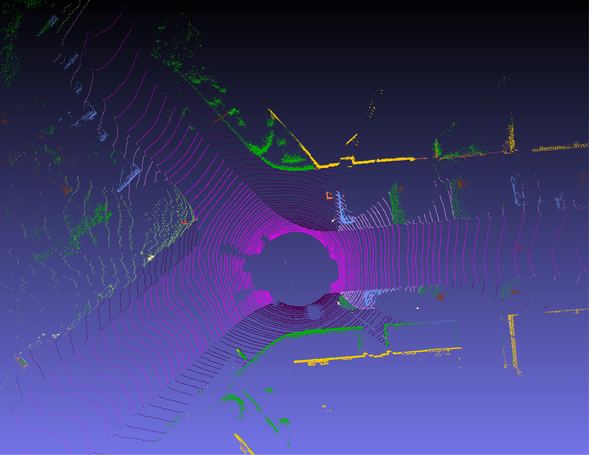

# Rangenet Library

This repository contains simple usage explanations of how the RangeNet++ inference works with the TensorRT and C++ interface.

Developed by [Xieyuanli Chen](http://www.ipb.uni-bonn.de/people/xieyuanli-chen/), [Andres Milioto](http://www.ipb.uni-bonn.de/people/andres-milioto/) and [Jens Behley](http://www.ipb.uni-bonn.de/people/jens-behley/).

For more details about RangeNet++, one could find in [LiDAR-Bonnetal](https://github.com/PRBonn/lidar-bonnetal).

<p align="center">
  
</p>

---
## How to use

#### Dependencies

##### System dependencies
First you need to install the nvidia driver and CUDA.

- CUDA Installation guide: [Link](https://docs.nvidia.com/cuda/cuda-installation-guide-linux/index.html)

- Then you can do the other dependencies:

  ```sh
  $ sudo apt-get update 
  $ sudo apt-get install -yqq  build-essential python3-dev python3-pip apt-utils git cmake libboost-all-dev libyaml-cpp-dev libopencv-dev
  ```
  
##### Python dependencies

- Then install the Python packages needed:

  ```sh
  $ sudo apt install python-empy
  $ sudo pip install catkin_tools trollius numpy
  ```
  
##### TensorRT

In order to infer with TensorRT (>=5.0) during inference with the C++ libraries:

- Install TensorRT: [Link](https://developer.nvidia.com/tensorrt).

#### Build the library
We use the catkin tool to build the library.

  ```sh
  $ mkdir -p ~/catkin_ws/src
  $ cd ~/catkin_ws/src
  $ git clone https://github.com/ros/catkin.git 
  $ git clone https://github.com/PRBonn/rangenet_lib.git
  $ cd .. && catkin init
  $ catkin build rangenet_lib
  ```

#### Run the demo

To run the demo, you need a pre-trained model, which can be downloaded here, [model](http://www.ipb.uni-bonn.de/html/projects/semantic_suma/darknet53.tar.gz). 

A single LiDAR scan for running the demo, you could find in the example folder `example/000000.bin`. For more LiDAR data, you could download from [KITTI odometry dataset](http://www.cvlibs.net/datasets/kitti/eval_odometry.php).

For more details about how to train and evaluate a model, please refer to [LiDAR-Bonnetal](https://github.com/PRBonn/lidar-bonnetal).

To infer a single LiDAR scan and visualize the semantic point cloud:

  ```sh
  # go to the root path of the catkin workspace
  $ cd ~/catkin_ws
  # use --verbose or -v to get verbose mode
  $ ./devel/lib/rangenet_lib/infer -h # help
  $ ./devel/lib/rangenet_lib/infer -p /path/to/the/pretrained/model -s /path/to/the/scan.bin --verbose
  ```

**Notice**: for the first time running, it will take several minutes to generate a `.trt` model for C++ interface.

#### Run SuMa++: Efficient LiDAR-based Semantic SLAM
Using rangenet_lib, we built a LiDAR-based Semantic SLAM system, called SuMa++.

You could find more implementation details in [SuMa++](https://github.com/PRBonn/semantic_suma/).

## Citations

If you use this library for any academic work, please cite the original [paper](http://www.ipb.uni-bonn.de/wp-content/papercite-data/pdf/milioto2019iros.pdf).

```
@inproceedings{milioto2019iros,
  author    = {A. Milioto and I. Vizzo and J. Behley and C. Stachniss},
  title     = {{RangeNet++: Fast and Accurate LiDAR Semantic Segmentation}},
  booktitle = {IEEE/RSJ Intl.~Conf.~on Intelligent Robots and Systems (IROS)},
  year      = 2019,
  codeurl   = {https://github.com/PRBonn/lidar-bonnetal},
  videourl  = {https://youtu.be/wuokg7MFZyU},
}
```

If you use SuMa++, please cite the corresponding [paper](http://www.ipb.uni-bonn.de/wp-content/papercite-data/pdf/chen2019iros.pdf):

```
@inproceedings{chen2019iros, 
  author    = {X. Chen and A. Milioto and E. Palazzolo and P. Giguère and J. Behley and C. Stachniss},
  title     = {{SuMa++: Efficient LiDAR-based Semantic SLAM}},
  booktitle = {Proceedings of the IEEE/RSJ Int. Conf. on Intelligent Robots and Systems (IROS)},
  year      = {2019},
  codeurl   = {https://github.com/PRBonn/semantic_suma/},
  videourl  = {https://youtu.be/uo3ZuLuFAzk},
}
```

## License

Copyright 2019, Xieyuanli Chen, Andres Milioto, Jens Behley, Cyrill Stachniss, University of Bonn.

This project is free software made available under the MIT License. For details see the LICENSE file.
